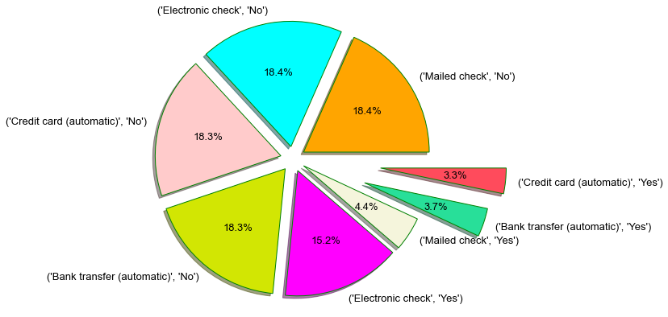
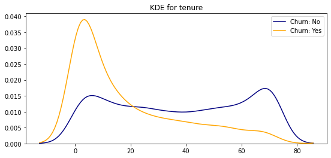
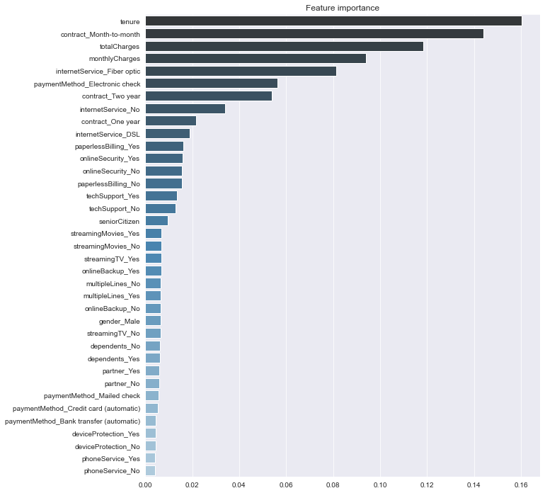

# Telco Customer Churn : Project Overview

   

## Business Problem
  
  * Predict behavior to retain customers. 
  * Analyze all relevant customer data and develop focused customer retention programs.

## Gather Data
  Get details about [Boston Dataset](https://scikit-learn.org/stable/modules/generated/sklearn.datasets.load_boston.html)
   
## EDA
   
   
   

      
## Model
